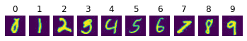

# MNIST Digit Recognizer

#### Importing Required Libraries


```python
import os
import cv2
import random
import pickle
import zipfile
import datetime
import numpy as np
import tensorflow as tf
import matplotlib.pyplot as plt
import matplotlib.image as mpimg

from google.colab import files
from tensorflow.keras.preprocessing import image
from tensorflow.keras.preprocessing.image import ImageDataGenerator
```

#### Downloading Train and Test Data


```python
# Downloading train data into temporal storage
!wget --no-check-certificate https://archive.org/download/mnist_digit_recognizer_dataset/train.zip -O /tmp/train.zip

# Downloading test data into temporal storage
!wget --no-check-certificate https://archive.org/download/mnist_digit_recognizer_dataset/test.zip -O /tmp/test.zip
```

    --2021-05-27 20:55:39--  https://archive.org/download/mnist_digit_recognizer_dataset/train.zip
    Resolving archive.org (archive.org)... 207.241.224.2
    Connecting to archive.org (archive.org)|207.241.224.2|:443... connected.
    HTTP request sent, awaiting response... 302 Found
    Location: https://ia801408.us.archive.org/17/items/mnist_digit_recognizer_dataset/train.zip [following]
    --2021-05-27 20:55:39--  https://ia801408.us.archive.org/17/items/mnist_digit_recognizer_dataset/train.zip
    Resolving ia801408.us.archive.org (ia801408.us.archive.org)... 207.241.228.148
    Connecting to ia801408.us.archive.org (ia801408.us.archive.org)|207.241.228.148|:443... connected.
    HTTP request sent, awaiting response... 200 OK
    Length: 30205580 (29M) [application/zip]
    Saving to: ‘/tmp/train.zip’
    
    /tmp/train.zip      100%[===================>]  28.81M  11.0MB/s    in 2.6s    
    
    2021-05-27 20:55:42 (11.0 MB/s) - ‘/tmp/train.zip’ saved [30205580/30205580]
    
    --2021-05-27 20:55:42--  https://archive.org/download/mnist_digit_recognizer_dataset/test.zip
    Resolving archive.org (archive.org)... 207.241.224.2
    Connecting to archive.org (archive.org)|207.241.224.2|:443... connected.
    HTTP request sent, awaiting response... 302 Found
    Location: https://ia801408.us.archive.org/17/items/mnist_digit_recognizer_dataset/test.zip [following]
    --2021-05-27 20:55:43--  https://ia801408.us.archive.org/17/items/mnist_digit_recognizer_dataset/test.zip
    Resolving ia801408.us.archive.org (ia801408.us.archive.org)... 207.241.228.148
    Connecting to ia801408.us.archive.org (ia801408.us.archive.org)|207.241.228.148|:443... connected.
    HTTP request sent, awaiting response... 200 OK
    Length: 20236148 (19M) [application/zip]
    Saving to: ‘/tmp/test.zip’
    
    /tmp/test.zip       100%[===================>]  19.30M  4.66MB/s    in 4.3s    
    
    2021-05-27 20:55:47 (4.50 MB/s) - ‘/tmp/test.zip’ saved [20236148/20236148]
    
    

#### Extracting From Train and Test Zip Files


```python
# Extracting train data
local_zip = '/tmp/train.zip'
zip_file = zipfile.ZipFile(local_zip, 'r')
zip_file.extractall('/tmp')
zip_file.close()

# Extracting test data
local_zip = '/tmp/test.zip'
zip_file = zipfile.ZipFile(local_zip, 'r')
zip_file.extractall('/tmp')
zip_file.close()
```

#### Getting Directory Paths for Train and Test Data


```python
# Getting number of images in train data
count = 0
for class_name in sorted(os.listdir('/tmp/train')):
  count += len(os.listdir('/tmp/train/' + class_name))

# Printing number of images in train and test images
print('Number of images in train data:', count)
print('Number of images in test data:', len(os.listdir('/tmp/test/test')))
```

    Number of images in train data: 42000
    Number of images in test data: 28000
    

#### Printing Random Images for Each Class


```python
# Creating a plotting figure and axes
fig, axes = plt.subplots(1, 10)

# Iterating over every class and printing a single random image
for class_name in sorted(os.listdir('/tmp/train')):
  random_index = random.randint(0, len(os.listdir('/tmp/train/' + class_name)) - 1)
  random_image_name = os.listdir('/tmp/train/' + class_name)[random_index]
  image_path ='/tmp/train/' + class_name + '/' + random_image_name
  img = mpimg.imread(image_path)
  axes[int(class_name)].imshow(img)
  axes[int(class_name)].axis('off')
  axes[int(class_name)].set_title(class_name)
```


    

    


#### Setting Up Image Data Generators


```python
# Creating batch size
batch_size = 1000
```


```python
# Setting up train data directory and its ImageDataGenerator
TRAINING_DIR = '/tmp/train/'
training_datagen = ImageDataGenerator(
    rescale = 1./255,
    rotation_range = 40,
    width_shift_range = 0.2,
    height_shift_range = 0.2,
    shear_range = 0.2,
    zoom_range = 0.2,
    fill_mode = 'nearest',
    validation_split = 0.2
)

# Setting up test data directory and its ImageDataGenerator
TEST_DIR = '/tmp/test/'
test_datagen = ImageDataGenerator(rescale = 1./255)

# Setting up data generator flow
training_generator = training_datagen.flow_from_directory(TRAINING_DIR, target_size=(28, 28), class_mode='categorical', color_mode='grayscale',
                                                          batch_size=batch_size, subset='training', seed=42)

validation_generator = training_datagen.flow_from_directory(TRAINING_DIR, target_size=(28, 28), class_mode='categorical', color_mode='grayscale',
                                                            batch_size=batch_size, subset='validation', seed=42)

test_generator = test_datagen.flow_from_directory(TEST_DIR, target_size=(28, 28), class_mode=None, color_mode='grayscale',
                                                  shuffle=False, batch_size=1) 
```

    Found 33604 images belonging to 10 classes.
    Found 8396 images belonging to 10 classes.
    Found 28000 images belonging to 1 classes.
    

#### Setting Up Deep Neural Network Structure


```python
# Defining the neural network model structure
model = tf.keras.models.Sequential([
            tf.keras.layers.Conv2D(32, (3, 3), activation='relu', input_shape=(28, 28, 1), padding='same'),
            tf.keras.layers.MaxPooling2D(2, 2),
            tf.keras.layers.Conv2D(64, (3, 3), activation='relu', padding='same'),
            tf.keras.layers.MaxPooling2D(2, 2),
            tf.keras.layers.Conv2D(128, (3, 3), activation='relu', padding='same'),
            tf.keras.layers.MaxPooling2D(2, 2),
            tf.keras.layers.Flatten(),
            tf.keras.layers.Dense(512, activation='relu'),
            tf.keras.layers.Dense(10, activation='softmax')
        ])

# Printing model summary
model.summary()

# Compiling the model
model.compile(loss='categorical_crossentropy', optimizer='adam', metrics=['acc'])

# Setting some required parameters
epochs = 15
steps_per_epoch = training_generator.n // training_generator.batch_size
validation_steps = validation_generator.n // validation_generator.batch_size
test_steps = test_generator.n // test_generator.batch_size
```

    Model: "sequential"
    _________________________________________________________________
    Layer (type)                 Output Shape              Param #   
    =================================================================
    conv2d (Conv2D)              (None, 28, 28, 32)        320       
    _________________________________________________________________
    max_pooling2d (MaxPooling2D) (None, 14, 14, 32)        0         
    _________________________________________________________________
    conv2d_1 (Conv2D)            (None, 14, 14, 64)        18496     
    _________________________________________________________________
    max_pooling2d_1 (MaxPooling2 (None, 7, 7, 64)          0         
    _________________________________________________________________
    conv2d_2 (Conv2D)            (None, 7, 7, 128)         73856     
    _________________________________________________________________
    max_pooling2d_2 (MaxPooling2 (None, 3, 3, 128)         0         
    _________________________________________________________________
    flatten (Flatten)            (None, 1152)              0         
    _________________________________________________________________
    dense (Dense)                (None, 512)               590336    
    _________________________________________________________________
    dense_1 (Dense)              (None, 10)                5130      
    =================================================================
    Total params: 688,138
    Trainable params: 688,138
    Non-trainable params: 0
    _________________________________________________________________
    

#### Setting Up Log Directory and Callback for TensorBoard


```python
# setting timestamped logging directory and a callback function
log_dir = "logs/fit/" + datetime.datetime.now().strftime("%Y%m%d-%H%M%S")
tensorboard_callback = tf.keras.callbacks.TensorBoard(log_dir=log_dir, histogram_freq=1)
```

#### Training and Evaluating the Model


```python
# Training the model
history = model.fit(training_generator, epochs=epochs, steps_per_epoch=steps_per_epoch, 
                    validation_data=validation_generator, validation_steps=validation_steps, verbose=1,
                    callbacks=[tensorboard_callback])

# Evaluating the model
print('\nValidation Loss and Accuracy')
model.evaluate(validation_generator, steps=validation_steps)
```

    Epoch 1/15
    33/33 [==============================] - 51s 593ms/step - loss: 1.7366 - acc: 0.4080 - val_loss: 1.1526 - val_acc: 0.6445
    Epoch 2/15
    33/33 [==============================] - 19s 582ms/step - loss: 0.8878 - acc: 0.7174 - val_loss: 0.6688 - val_acc: 0.7934
    Epoch 3/15
    33/33 [==============================] - 19s 579ms/step - loss: 0.5795 - acc: 0.8199 - val_loss: 0.5048 - val_acc: 0.8509
    Epoch 4/15
    33/33 [==============================] - 19s 583ms/step - loss: 0.4402 - acc: 0.8668 - val_loss: 0.3766 - val_acc: 0.8848
    Epoch 5/15
    33/33 [==============================] - 19s 584ms/step - loss: 0.3518 - acc: 0.8917 - val_loss: 0.3189 - val_acc: 0.9045
    Epoch 6/15
    33/33 [==============================] - 18s 554ms/step - loss: 0.2967 - acc: 0.9102 - val_loss: 0.2694 - val_acc: 0.9137
    Epoch 7/15
    33/33 [==============================] - 18s 557ms/step - loss: 0.2619 - acc: 0.9181 - val_loss: 0.2427 - val_acc: 0.9216
    Epoch 8/15
    33/33 [==============================] - ETA: 0s - loss: 0.2256 - acc: 0.9313Epoch 9/15
    33/33 [==============================] - 19s 579ms/step - loss: 0.1997 - acc: 0.9386 - val_loss: 0.1861 - val_acc: 0.9438
    Epoch 10/15
    33/33 [==============================] - 18s 548ms/step - loss: 0.1867 - acc: 0.9434 - val_loss: 0.1836 - val_acc: 0.9435
    Epoch 11/15
    33/33 [==============================] - 19s 581ms/step - loss: 0.1698 - acc: 0.9471 - val_loss: 0.1641 - val_acc: 0.9513
    Epoch 12/15
    33/33 [==============================] - 19s 578ms/step - loss: 0.1672 - acc: 0.9484 - val_loss: 0.1552 - val_acc: 0.9521
    Epoch 13/15
    33/33 [==============================] - 18s 550ms/step - loss: 0.1454 - acc: 0.9555 - val_loss: 0.1525 - val_acc: 0.9529
    Epoch 14/15
    33/33 [==============================] - 18s 553ms/step - loss: 0.1455 - acc: 0.9537 - val_loss: 0.1616 - val_acc: 0.9511
    Epoch 15/15
    33/33 [==============================] - 19s 580ms/step - loss: 0.1335 - acc: 0.9576 - val_loss: 0.1314 - val_acc: 0.9586
    
    Validation Loss and Accuracy
    8/8 [==============================] - 3s 421ms/step - loss: 0.1341 - acc: 0.9582
    


    [0.13413821160793304, 0.9582499861717224]


#### Plotting Training and Validation Accuracy and Loss Functions


```python
# Extracting the accuracy and loss functions
acc = history.history['acc']
val_acc = history.history['val_acc']
loss = history.history['loss']
val_loss = history.history['val_loss']

# Creating range of number of epochs
epochs = range(len(acc))

# Plotting training and validation accuracy
plt.plot(epochs, acc, 'r', label='Training Accuracy')
plt.plot(epochs, val_acc, 'b', label='Validation Accuracy')
plt.title('Training and Validation Accuracy')
plt.xlabel('Number of Epochs')
plt.ylabel('Accuracy')
plt.legend()
plt.show()

# Plotting training and validation loss functions
plt.plot(epochs, loss, 'r', label='Training Loss')
plt.plot(epochs, val_loss, 'b', label='Validation Loss')
plt.title('Training and Validation Loss')
plt.xlabel('Number of Epochs')
plt.ylabel('Loss')
plt.legend()
plt.show()
```


    

    


    

    


#### Predicting on Test Data using the Model


```python
# Predicting on test data
y_pred = model.predict(test_generator, steps=test_steps, verbose=1)
y_pred = np.argmax(y_pred, axis=1)
test_file_names = test_generator.filenames
```

    28000/28000 [==============================] - 39s 1ms/step
    

#### Plotting Random Test images with their Predicted Value


```python
# Selecting 25 random indices between 0 and 27999
random_indices = [random.randint(0, 27999) for i in range(25)]
print(random_indices)

# Plotting test images on these indices with their predicted class
fig, axes = plt.subplots(1, 25, figsize=(24,3))
for i, index in enumerate(random_indices):
  img = mpimg.imread('/tmp/test/' + test_file_names[index])
  axes[i].imshow(img)
  axes[i].set_title(y_pred[index])
  axes[i].axis('off')

```

    [5278, 25447, 5486, 17961, 12624, 21697, 9117, 25131, 22639, 14470, 7760, 17253, 4267, 17834, 17741, 15390, 19293, 23686, 11554, 22295, 6461, 14263, 5632, 8827, 9245]
    


    

    


#### Recognizing Real World Images


```python
# Downloading test image
!wget https://www.publicdomainpictures.net/pictures/30000/velka/numbers.jpg -O /tmp/test_image.jpg
```

    --2021-05-27 21:02:10--  https://www.publicdomainpictures.net/pictures/30000/velka/numbers.jpg
    Resolving www.publicdomainpictures.net (www.publicdomainpictures.net)... 104.20.45.162, 104.20.44.162, 172.67.2.204, ...
    Connecting to www.publicdomainpictures.net (www.publicdomainpictures.net)|104.20.45.162|:443... connected.
    HTTP request sent, awaiting response... 200 OK
    Length: 152408 (149K) [image/jpeg]
    Saving to: ‘/tmp/test_image.jpg’
    
    /tmp/test_image.jpg 100%[===================>] 148.84K  --.-KB/s    in 0.004s  
    
    2021-05-27 21:02:11 (38.0 MB/s) - ‘/tmp/test_image.jpg’ saved [152408/152408]
    
    


```python
# Recognizing and plotting contours (bounding boxes) around digits
image = cv2.imread('/tmp/test_image.jpg')
grey = cv2.cvtColor(image.copy(), cv2.COLOR_BGR2GRAY)

ret, thresh = cv2.threshold(grey.copy(), 75, 255, cv2.THRESH_BINARY_INV)
contours, _ = cv2.findContours(thresh.copy(), cv2.RETR_EXTERNAL, cv2.CHAIN_APPROX_SIMPLE)
preprocessed_digits = []

for c in contours:
    # Getting coordinates of the contour
    x,y,w,h = cv2.boundingRect(c)

    # Ignoring very small contour (< 0.1% area of total image)
    if w*h < grey.shape[1]*grey.shape[0]*0.001 :
      continue

    # Creating a rectangle around the digit in the original image (for displaying the digits fetched via contours)
    cv2.rectangle(image, (x,y), (x+w, y+h), color=(0, 255, 0), thickness=2)
    
    # Cropping out the digit from the image corresponding to the current contours in the for loop
    digit = thresh[y:y+h, x:x+w]
    
    # Ignoring completely white images
    if np.min(digit.reshape(-1)) == np.max(digit.reshape(-1)):
      continue

    # Resizing that digit to (18, 18)
    resized_digit = cv2.resize(digit, (18,18))
    
    
    # Padding the digit with 5 pixels of black color (zeros) in each side to finally produce the image of (28, 28)
    padded_digit = np.pad(resized_digit, ((5,5),(5,5)), "constant", constant_values=0)
    
    # Adding the preprocessed digit to the list of preprocessed digits
    preprocessed_digits.append(padded_digit)

plt.imshow(image, cmap="gray")
plt.axis('off')
plt.show()
```


    

    


```python
# Predicting on recognized digits using the model
for digit in preprocessed_digits:
    prediction = model.predict(digit.reshape(1, 28, 28, 1))  
    
    plt.imshow(digit.reshape(28, 28), cmap="gray")
    plt.axis('off')
    plt.show()
    print("Final Output: {}\n".format(np.argmax(prediction)))
```


    

    


    Final Output: 8
    
    


    

    


    Final Output: 5
    
    


    

    


    Final Output: 8
    
    


    

    


    Final Output: 7
    
    

#### Saving the Trained Model


```python
# Saving the trained model 
model.save('saved_model/my_model')

# Convert folder to zip and download
!zip -r /content/file.zip /content/saved_model
files.download("/content/file.zip")
```

    INFO:tensorflow:Assets written to: saved_model/my_model/assets
      adding: content/saved_model/ (stored 0%)
      adding: content/saved_model/my_model/ (stored 0%)
      adding: content/saved_model/my_model/assets/ (stored 0%)
      adding: content/saved_model/my_model/keras_metadata.pb (deflated 92%)
      adding: content/saved_model/my_model/saved_model.pb (deflated 88%)
      adding: content/saved_model/my_model/variables/ (stored 0%)
      adding: content/saved_model/my_model/variables/variables.data-00000-of-00001 (deflated 6%)
      adding: content/saved_model/my_model/variables/variables.index (deflated 66%)


#### Exploring Using TensorBoard


```python
# Load the TensorBoard notebook extension
%load_ext tensorboard

# Start tensorboard within notebook using magics
%tensorboard --logdir logs
```
