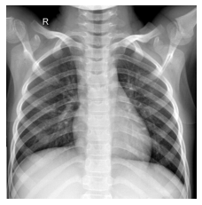
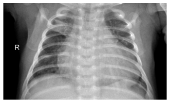
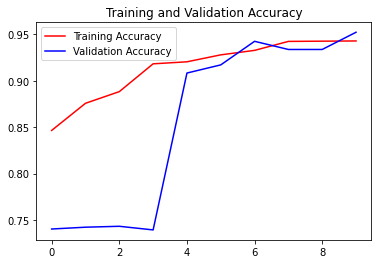
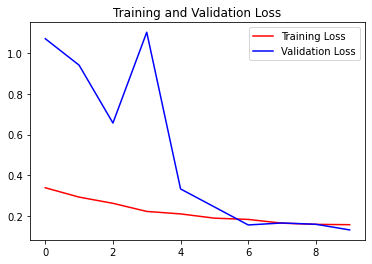

# Chest X-Ray Pneumonia Classification

#### Importing Required Files


```python
import os
import random
import zipfile
import numpy as np
import tensorflow as tf
import matplotlib.pyplot as plt
import matplotlib.image as mpimg

from google.colab import files
from tensorflow.keras.preprocessing import image
from tensorflow.keras.preprocessing.image import ImageDataGenerator

%matplotlib inline
```

#### Downloading the Train and Test Data


```python
# Downloading the train data into temporary storage
!wget --no-check-certificate https://archive.org/download/pneumonia_chest_xray/train.zip -O /tmp/train.zip

# Downloading the validation data into temporary storage
!wget --no-check-certificate https://archive.org/download/pneumonia_chest_xray/val.zip -O /tmp/val.zip

# Downloading the test data into temporary storage
!wget --no-check-certificate https://archive.org/download/pneumonia_chest_xray/test.zip -O /tmp/test.zip
```

    --2021-07-09 10:58:17--  https://archive.org/download/pneumonia_chest_xray/train.zip
    Resolving archive.org (archive.org)... 207.241.224.2
    Connecting to archive.org (archive.org)|207.241.224.2|:443... connected.
    HTTP request sent, awaiting response... 302 Found
    Location: https://ia903405.us.archive.org/24/items/pneumonia_chest_xray/train.zip [following]
    --2021-07-09 10:58:19--  https://ia903405.us.archive.org/24/items/pneumonia_chest_xray/train.zip
    Resolving ia903405.us.archive.org (ia903405.us.archive.org)... 207.241.230.195
    Connecting to ia903405.us.archive.org (ia903405.us.archive.org)|207.241.230.195|:443... connected.
    HTTP request sent, awaiting response... 200 OK
    Length: 1145345857 (1.1G) [application/zip]
    Saving to: ‘/tmp/train.zip’
    
    /tmp/train.zip      100%[===================>]   1.07G   512KB/s    in 28m 57s 
    
    2021-07-09 11:27:16 (644 KB/s) - ‘/tmp/train.zip’ saved [1145345857/1145345857]
    
    --2021-07-09 11:27:16--  https://archive.org/download/pneumonia_chest_xray/val.zip
    Resolving archive.org (archive.org)... 207.241.224.2
    Connecting to archive.org (archive.org)|207.241.224.2|:443... connected.
    HTTP request sent, awaiting response... 302 Found
    Location: https://ia803405.us.archive.org/24/items/pneumonia_chest_xray/val.zip [following]
    --2021-07-09 11:27:17--  https://ia803405.us.archive.org/24/items/pneumonia_chest_xray/val.zip
    Resolving ia803405.us.archive.org (ia803405.us.archive.org)... 207.241.232.195
    Connecting to ia803405.us.archive.org (ia803405.us.archive.org)|207.241.232.195|:443... connected.
    HTTP request sent, awaiting response... 200 OK
    Length: 2953511 (2.8M) [application/zip]
    Saving to: ‘/tmp/val.zip’
    
    /tmp/val.zip        100%[===================>]   2.82M  1.87MB/s    in 1.5s    
    
    2021-07-09 11:27:19 (1.87 MB/s) - ‘/tmp/val.zip’ saved [2953511/2953511]
    
    --2021-07-09 11:27:19--  https://archive.org/download/pneumonia_chest_xray/test.zip
    Resolving archive.org (archive.org)... 207.241.224.2
    Connecting to archive.org (archive.org)|207.241.224.2|:443... connected.
    HTTP request sent, awaiting response... 302 Found
    Location: https://ia803405.us.archive.org/24/items/pneumonia_chest_xray/test.zip [following]
    --2021-07-09 11:27:20--  https://ia803405.us.archive.org/24/items/pneumonia_chest_xray/test.zip
    Resolving ia803405.us.archive.org (ia803405.us.archive.org)... 207.241.232.195
    Connecting to ia803405.us.archive.org (ia803405.us.archive.org)|207.241.232.195|:443... connected.
    HTTP request sent, awaiting response... 200 OK
    Length: 77677911 (74M) [application/zip]
    Saving to: ‘/tmp/test.zip’
    
    /tmp/test.zip       100%[===================>]  74.08M   399KB/s    in 3m 17s  
    
    2021-07-09 11:30:37 (386 KB/s) - ‘/tmp/test.zip’ saved [77677911/77677911]
    
    

#### Extracting the Train and Test Data Zip Files


```python
# Extracting the train data
local_zip = '/tmp/train.zip'
zip_ref = zipfile.ZipFile(local_zip, 'r')
zip_ref.extractall('/tmp/')
zip_ref.close()

# Extracting the validation data
local_zip = '/tmp/val.zip'
zip_ref = zipfile.ZipFile(local_zip, 'r')
zip_ref.extractall('/tmp')
zip_ref.close()

# Extracting the test data
local_zip = '/tmp/test.zip'
zip_ref = zipfile.ZipFile(local_zip, 'r')
zip_ref.extractall('/tmp')
zip_ref.close()
```

#### Getting Directory Paths for Each Class


```python
# Setting up class directories for training data
normal_dir = '/tmp/train/NORMAL'
pneumonia_dir = '/tmp/train/PNEUMONIA'

# Printing number of images in each class
print('Total training normal images: ', len(os.listdir(normal_dir)))
print('Total training pneumonia images: ', len(os.listdir(pneumonia_dir)))

# Getting list of image names for each class
normal_files = os.listdir(normal_dir)
pneumonia_files = os.listdir(pneumonia_dir)
```

    Total training normal images:  1341
    Total training pneumonia images:  3875
    

#### Printing Image for Each Class for Given Index


```python
# Getting a valid random index between 0 and 1341
image_index = random.randint(0, 1340)

# Creating the image directories for the index for each class
next_normal = os.path.join(normal_dir, normal_files[image_index])
next_pneumonia = os.path.join(pneumonia_dir, pneumonia_files[image_index])

# Plotting the images for both classes
for img_path in [next_normal, next_pneumonia]:
  img = mpimg.imread(img_path)
  plt.imshow(img, cmap='gray')
  plt.axis('off')
  plt.show()
```


    

    


    

    


#### Setting up Image Data Generators for Training and Validation Data


```python
# Fixing batch size
BATCH_SIZE = 32
```


```python
# Setting up train directory and its ImageDataGenerator
TRAINING_DIR = '/tmp/train'
training_datagen = ImageDataGenerator(
    rescale = 1./255,
    rotation_range=40, 
    zoom_range = 0.2,
    vertical_flip = True,
    fill_mode= 'nearest',
    validation_split = 0.2
)

# Setting up test directory and its ImageDataGenerator
TEST_DIR = '/tmp/test'
test_datagen = ImageDataGenerator(rescale = 1./255)

# Setting up training generator using flow_from_directory
training_generator = training_datagen.flow_from_directory(
    TRAINING_DIR,
    target_size = (299, 299),
    class_mode = 'binary',
    batch_size = BATCH_SIZE,
    subset = 'training'
)

# Setting up validation generator using flow_from_directory
validation_generator = training_datagen.flow_from_directory(
    TRAINING_DIR,
    target_size = (299, 299),
    class_mode = 'binary',
    batch_size = BATCH_SIZE,
    subset = 'validation'
)

# Setting up validation test using flow_from_directory
test_generator = test_datagen.flow_from_directory(
    TEST_DIR,
    target_size = (299, 299),
    class_mode = None,
    batch_size = 1
)
```

    Found 4173 images belonging to 2 classes.
    Found 1043 images belonging to 2 classes.
    Found 624 images belonging to 2 classes.
    

#### Setting up the Deep Neural Network Structure


```python
# Defining the neural network model structure
model = tf.keras.models.Sequential([
    tf.keras.layers.Conv2D(16, (3, 3), activation='relu', input_shape=(299, 299, 3), padding='same'),
    tf.keras.layers.Conv2D(16, (3, 3), activation='relu', padding='same'),
    tf.keras.layers.MaxPooling2D((2, 2)),

    tf.keras.layers.SeparableConv2D(32, (3, 3), activation='relu', padding='same'),
    tf.keras.layers.SeparableConv2D(32, (3, 3), activation='relu', padding='same'),
    tf.keras.layers.BatchNormalization(),
    tf.keras.layers.MaxPooling2D((2, 2)),

    tf.keras.layers.SeparableConv2D(64, (3, 3), activation='relu', padding='same'),
    tf.keras.layers.SeparableConv2D(64, (3, 3), activation='relu', padding='same'),
    tf.keras.layers.BatchNormalization(),
    tf.keras.layers.MaxPooling2D((2, 2)),

    tf.keras.layers.SeparableConv2D(128, (3, 3), activation='relu', padding='same'),
    tf.keras.layers.SeparableConv2D(128, (3, 3), activation='relu', padding='same'),
    tf.keras.layers.BatchNormalization(),
    tf.keras.layers.MaxPooling2D((2, 2)),
    tf.keras.layers.Dropout(0.2),

    tf.keras.layers.Flatten(),
    tf.keras.layers.Dense(512, activation='relu'),
    tf.keras.layers.Dropout(0.7),
    tf.keras.layers.Dense(128, activation='relu'),
    tf.keras.layers.Dropout(0.5),
    tf.keras.layers.Dense(64, activation='relu'),
    tf.keras.layers.Dropout(0.3),

    tf.keras.layers.Dense(1, activation='sigmoid')
])

# Printing model summary
model.summary()
```

    Model: "sequential"
    _________________________________________________________________
    Layer (type)                 Output Shape              Param #   
    =================================================================
    conv2d (Conv2D)              (None, 299, 299, 16)      448       
    _________________________________________________________________
    conv2d_1 (Conv2D)            (None, 299, 299, 16)      2320      
    _________________________________________________________________
    max_pooling2d (MaxPooling2D) (None, 149, 149, 16)      0         
    _________________________________________________________________
    separable_conv2d (SeparableC (None, 149, 149, 32)      688       
    _________________________________________________________________
    separable_conv2d_1 (Separabl (None, 149, 149, 32)      1344      
    _________________________________________________________________
    batch_normalization (BatchNo (None, 149, 149, 32)      128       
    _________________________________________________________________
    max_pooling2d_1 (MaxPooling2 (None, 74, 74, 32)        0         
    _________________________________________________________________
    separable_conv2d_2 (Separabl (None, 74, 74, 64)        2400      
    _________________________________________________________________
    separable_conv2d_3 (Separabl (None, 74, 74, 64)        4736      
    _________________________________________________________________
    batch_normalization_1 (Batch (None, 74, 74, 64)        256       
    _________________________________________________________________
    max_pooling2d_2 (MaxPooling2 (None, 37, 37, 64)        0         
    _________________________________________________________________
    separable_conv2d_4 (Separabl (None, 37, 37, 128)       8896      
    _________________________________________________________________
    separable_conv2d_5 (Separabl (None, 37, 37, 128)       17664     
    _________________________________________________________________
    batch_normalization_2 (Batch (None, 37, 37, 128)       512       
    _________________________________________________________________
    max_pooling2d_3 (MaxPooling2 (None, 18, 18, 128)       0         
    _________________________________________________________________
    dropout (Dropout)            (None, 18, 18, 128)       0         
    _________________________________________________________________
    flatten (Flatten)            (None, 41472)             0         
    _________________________________________________________________
    dense (Dense)                (None, 512)               21234176  
    _________________________________________________________________
    dropout_1 (Dropout)          (None, 512)               0         
    _________________________________________________________________
    dense_1 (Dense)              (None, 128)               65664     
    _________________________________________________________________
    dropout_2 (Dropout)          (None, 128)               0         
    _________________________________________________________________
    dense_2 (Dense)              (None, 64)                8256      
    _________________________________________________________________
    dropout_3 (Dropout)          (None, 64)                0         
    _________________________________________________________________
    dense_3 (Dense)              (None, 1)                 65        
    =================================================================
    Total params: 21,347,553
    Trainable params: 21,347,105
    Non-trainable params: 448
    _________________________________________________________________
    


```python
# Fixing some required parameters
num_epochs = 10
steps_per_epoch = training_generator.n // training_generator.batch_size
validation_steps = validation_generator.n // validation_generator.batch_size
test_steps = test_generator.n // test_generator.batch_size
```


```python
# Compiling the model
model.compile(loss='binary_crossentropy', optimizer='adam', metrics=['accuracy'])

# Setting up callback function for reducing learning rate when validation loss stops reducing
lr_reduce = tf.keras.callbacks.ReduceLROnPlateau(monitor = 'val_loss', factor = 0.3, patience = 2, verbose = 2, mode = 'max')
```


```python
# Training the model on train set and validating it on validation set
history = model.fit(training_generator, epochs=num_epochs, steps_per_epoch=steps_per_epoch, validation_data=validation_generator, 
                    validation_steps=validation_steps, callbacks=[lr_reduce], verbose=1)
```

    Epoch 1/10
    130/130 [==============================] - 203s 1s/step - loss: 0.3395 - accuracy: 0.8464 - val_loss: 1.0707 - val_accuracy: 0.7402
    Epoch 2/10
    130/130 [==============================] - 170s 1s/step - loss: 0.2935 - accuracy: 0.8756 - val_loss: 0.9408 - val_accuracy: 0.7422
    Epoch 3/10
    130/130 [==============================] - 170s 1s/step - loss: 0.2631 - accuracy: 0.8882 - val_loss: 0.6570 - val_accuracy: 0.7432
    
    Epoch 00003: ReduceLROnPlateau reducing learning rate to 0.0003000000142492354.
    Epoch 4/10
    130/130 [==============================] - 173s 1s/step - loss: 0.2233 - accuracy: 0.9181 - val_loss: 1.1025 - val_accuracy: 0.7393
    Epoch 5/10
    130/130 [==============================] - 171s 1s/step - loss: 0.2111 - accuracy: 0.9203 - val_loss: 0.3336 - val_accuracy: 0.9082
    Epoch 6/10
    130/130 [==============================] - 172s 1s/step - loss: 0.1902 - accuracy: 0.9278 - val_loss: 0.2454 - val_accuracy: 0.9170
    
    Epoch 00006: ReduceLROnPlateau reducing learning rate to 9.000000427477062e-05.
    Epoch 7/10
    130/130 [==============================] - 171s 1s/step - loss: 0.1840 - accuracy: 0.9326 - val_loss: 0.1569 - val_accuracy: 0.9424
    Epoch 8/10
    130/130 [==============================] - 169s 1s/step - loss: 0.1657 - accuracy: 0.9423 - val_loss: 0.1666 - val_accuracy: 0.9336
    
    Epoch 00008: ReduceLROnPlateau reducing learning rate to 2.700000040931627e-05.
    Epoch 9/10
    130/130 [==============================] - 169s 1s/step - loss: 0.1599 - accuracy: 0.9425 - val_loss: 0.1603 - val_accuracy: 0.9336
    Epoch 10/10
    130/130 [==============================] - 171s 1s/step - loss: 0.1582 - accuracy: 0.9428 - val_loss: 0.1326 - val_accuracy: 0.9521
    
    Epoch 00010: ReduceLROnPlateau reducing learning rate to 8.100000013655517e-06.
    

#### Plotting Training and Validation Accuracies and Loss Functions


```python
# Getting training and validation accuracies and losses
acc = history.history['accuracy']
val_acc = history.history['val_accuracy']
loss = history.history['loss']
val_loss = history.history['val_loss']

# Getting number of epochs
epochs = range(len(acc))

# Plotting the accuracy graphs
plt.plot(epochs, acc, 'r', label='Training Accuracy')
plt.plot(epochs, val_acc, 'b', label='Validation Accuracy')
plt.title('Training and Validation Accuracy')
plt.legend(loc=0)
plt.show()

# Plotting the loss functions
plt.plot(epochs, loss, 'r', label='Training Loss')
plt.plot(epochs, val_loss, 'b', label='Validation Loss')
plt.title('Training and Validation Loss')
plt.legend(loc=0)
plt.show()
```


    

    


    

    


#### Saving the Trained Model


```python
# Saving the trained model 
model.save('saved_model/my_model')

# Convert folder to zip and download
!zip -r /content/file.zip /content/saved_model
files.download("/content/file.zip")
```

    INFO:tensorflow:Assets written to: saved_model/my_model/assets
      adding: content/saved_model/ (stored 0%)
      adding: content/saved_model/my_model/ (stored 0%)
      adding: content/saved_model/my_model/saved_model.pb (deflated 90%)
      adding: content/saved_model/my_model/assets/ (stored 0%)
      adding: content/saved_model/my_model/variables/ (stored 0%)
      adding: content/saved_model/my_model/variables/variables.index (deflated 74%)
      adding: content/saved_model/my_model/variables/variables.data-00000-of-00001 (deflated 6%)
      adding: content/saved_model/my_model/keras_metadata.pb (deflated 94%)